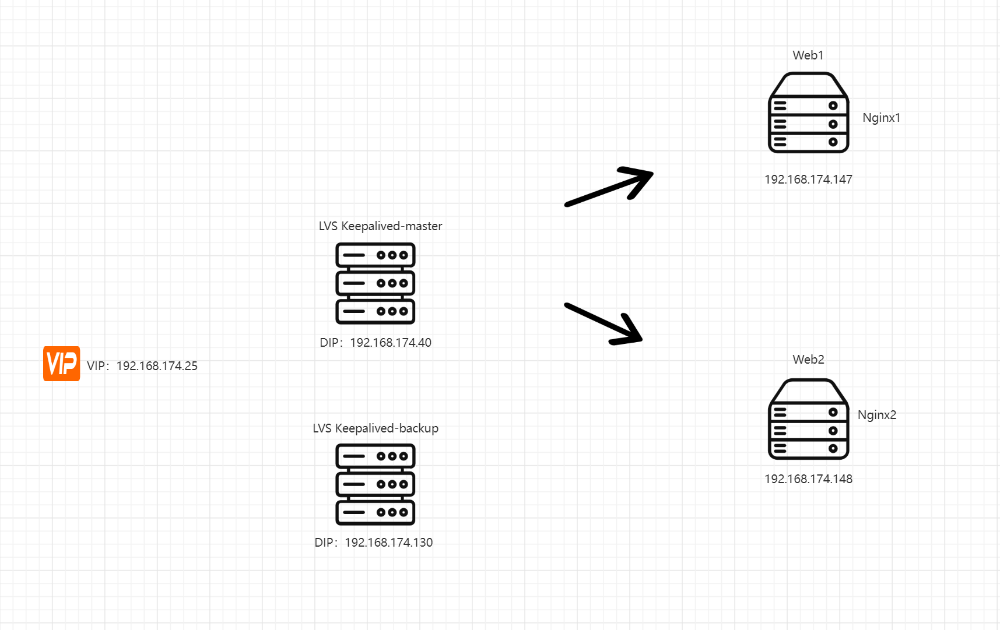
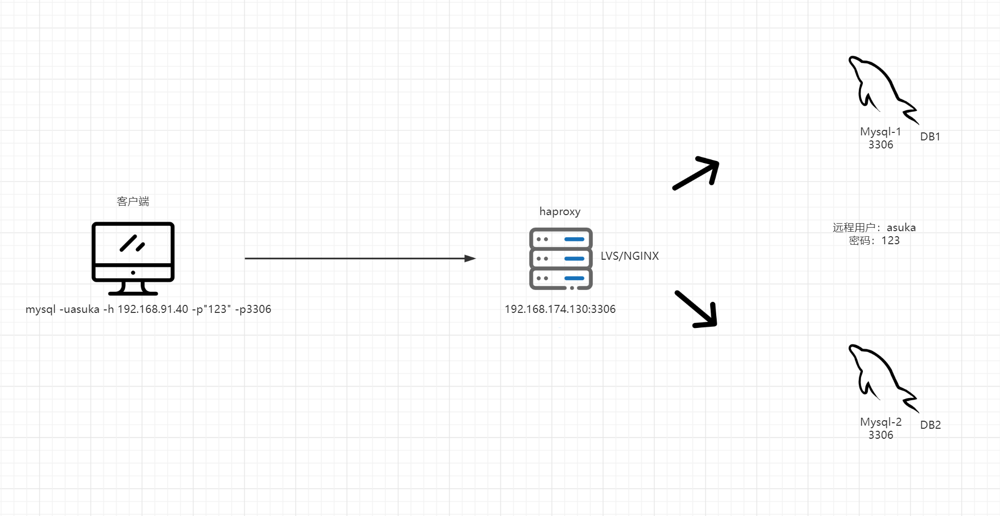

# LVS负载均衡流程图


# 四层负载均衡与七层负载均衡的区别？

```shell
|          | 四层负载均衡              | 七层负载均衡                               |
+----------+-------------------------+----------------------------------------------+
| 基于      | 基于IP+Port的           | 基于URL或主机IP等。                        |
+----------+-------------------------+----------------------------------------------+
| 类似于    | 路由器                   | 代理服务器                                     |
+----------+-------------------------+----------------------------------------------+
| 复杂度    | 低                      | 高                                           |
+----------+-------------------------+----------------------------------------------+
| 性能     | 高；无需解析内容           | 中；需要算法识别 URL和 HTTP head 等信息 |
+----------+-------------------------+----------------------------------------------+
| 安全性   | 低，                      | 高，                                        |
+----------+-------------------------+----------------------------------------------+
| 额外功能  | 无                       | 会话保持，图片压缩，防盗链、地址重写、流量限制等
```


# Nginx+Keepalived负载均衡原理是什么？


# LVS_Director + KeepAlived



# Mysql+keepalived



# LVS-Nat模式+Keepalived

