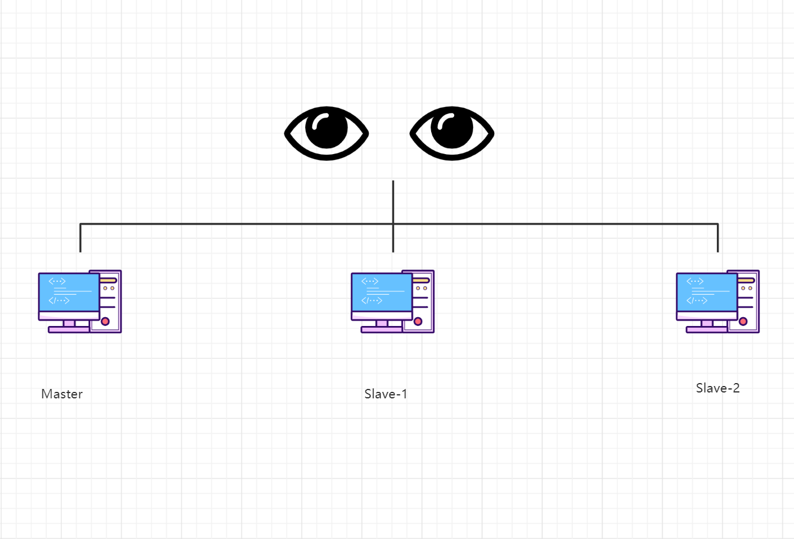

# 关系型数据库与非关系型数据库的区别

```shell
①，关系型数据库
关系型数据库相当于一个目录，这个目录是存放数据的库。库里存放表，相当于文件。

优点：
1、遵循四大事务(原子性、一致性、隔离性、持续性)
2、支持sql语句，可用于表结构的复杂查询。

缺点：
1、读写性能差，海量的数据压力大
2、高并发性能差，传统关系型数据库而言，硬盘I/O是很大的瓶颈
3、固定表结构，灵活度稍欠
Mysql是常用的关系型数据库。

②，非关系型数据库(Nosql、作为关系型数据库的补充)
非关系型数据是一种数据结构化存储方法的集合，可以是文档或者键值对等

优点：
1、灵活性：存储数据格式灵活可以是key,value形式、文档形式、图片形式等等，使用也灵活，应用场景广泛
2、高性能、速度快：nosql使用硬盘和内存，关系型数据库只能使用硬盘
3、高扩展性
4、成本低：开源

缺：
1、无标准查询语言、不提供sql支持
2、无事务处理能力
3、数据结构相对复杂，复杂查询方面稍欠
Redis是常用的非关系型数据库，且可持久化数据。

③，Mysql数据存储在磁盘中，redis数据存储在磁盘和内存中读写速度快。

④，Mysql端口号：3306、redis端口号：6379
```

# redis哨兵的原理是什么

```
原理：
sentinel是redis的高可用解决方案：由多个sentinel(slave)监视任意多个主服务器(master)，以及这些主服务器属下的所有服务器。若被监视的主服务器下线了，自动将某个从服务器升级为主服务器。简单的讲：哨兵就是带有自动故障转移功能的主从架构
```



```shell
流程
1、将宕机的master下线
2、找一个slave作为master
3、通知所有的slave连接新的master
4、启动新的master与slave
```

# redis数据库持久化的方式有几种

```shell
RDB（Redis DataBase）和AOF（Append Only File）。
```

```shell
RDB（Redis DataBase）：
不同的时间点，将redis存储的数据生成快照并存储到磁盘上

特点:
1.周期性

2.不影响数据写入：
RDB会启动子进程，备份所有数据。
当前进程，继续提供数据的读写。
当备份完成，才替换老的备份文件。

3.高效：一次性还原所有数据

4.完整性较差：故障点到上一次备份之间的数据无法恢复。
```

```shell
AOF（Append Only File）
将redis执行过的所有指令记录下来，在下次redis重新启动时，只要把这些指令从
前到后再重复执行一遍，就可以实现数据恢复了。

特点:
1.实时性
2.完整性较好
3.体积大：记录数据的指令，删除数据的指令都会被记录下来。
```

# redis集群模式有几种？以及区别？

```shell
1、主从复制模式
2、sentinel(哨兵)模式
3、Cluster模式
```


```shell
主从模式：
读写分离、备份数据、负载均衡，一个Master可以有多个Slaves。

sentinel：
监控、着眼于高可用，发现master挂了后，就会从slave中重新选举一个master。

cluster：
是为了解决单机Redis容量有限的问题，将压力分配多台机器上，提高并发量。
```

# redis哨兵监控的优缺点？

```shell
优点：
1、哨兵集群，基于主从复制模式，所有的主从配置优点，它都有
2、监控、着眼于高可用，发现master挂了后，就会从slave中重新选举一个master
缺点：
1、Redis不好在线扩容的，集群容量一旦到达上限，在线扩容麻烦
2、哨兵模式的配置繁琐
```

# redis什么配置？

```
4核 32G
```


# mysql和redis有什么联系？

```
mysql和redis结合使用，提高web应用性能。
redis可作为缓存数据库，用于缓存热门的、频繁的数据操作，比如：抖音
mysql可长期的存储数据。
mysql和redis组合可提高数据库读写速度，减少数据库压力，提升web服务器性能。
```


